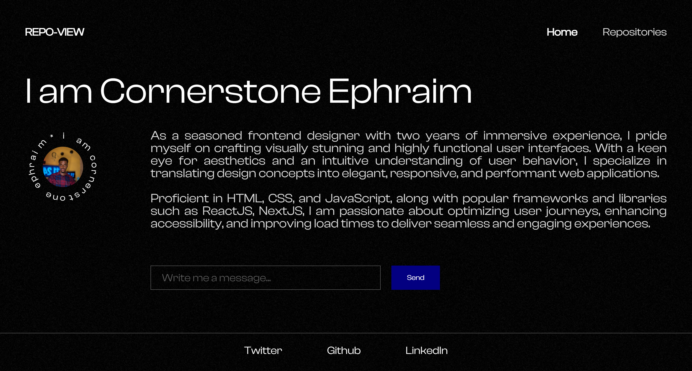

<div id="top"></div>

# Introduction

<header>
        <h2>My GitHub Portfolio App</h2>
        <p>Welcome to My GitHub Portfolio App! This application showcases my GitHub repositories in a sleek web interface. Whether you're a recruiter or a fellow developer, you can easily navigate through my projects, view detailed information, and even check out the source code.</p>
</header>

<section>
        <h2>Features</h2>
        <ol>
            <li><strong>Repository List:</strong> View a list of all my public repositories on GitHub. Click on a repository to see detailed information about that project.</li>
            <li><strong>Repository Details:</strong> Get more detailed information on any repository. This includes the description, number of stars, programming language used, and other relevant data.</li>
            <li><strong>Error Handling:</strong> The app gracefully handles errors, ensuring a smooth user experience. If something goes wrong, you'll be guided on how to refresh or navigate back to the main page.</li>
            <li><strong>Responsive Design:</strong> Enjoy a seamless experience on both desktop and mobile devices, thanks to the responsive design.</li>
            <li><strong>404 Page:</strong> If you try to navigate to a non-existent page, you'll be directed to a custom 404 page with guidance to get back on track.</li>
        </ol>
</section>

<section>
        <h2>How It Works</h2>
        <p>This web app uses the GitHub API to fetch data about my repositories. It's built with React, showcasing modern practices like nested routing, error boundaries, and functional components. The app's state-of-the-art error boundary technology ensures that any hiccups are handled gracefully, improving reliability and user experience.</p>
</section>
<br>

### Built With

 <table width="100%">
     <tbody  width="100%">
  <tr  width="100%">
    <td align="center" width="200px">
      <a href="https://reactjs.org/" target="_blank" rel="noreferrer"></a>
    </td>

   <td align="Center" width="200px">
        <a href="https://developer.mozilla.org/en-US/docs/Web/JavaScript" target="_blank" rel="noreferrer"></a>
    </td>
  <td align="Center" width="200px">
      <a href="https://tailwindcss.com/" target="_blank" rel="noreferrer"></a>
    </td>
  <td align="Center" width="200px">
      <a href="https://figma.com/" target="_blank" rel="noreferrer"></a>
    </td>
  <td align="Center" width="200px">
      <a href="https://github.com/" target="_blank" rel="noreferrer"></a>
    </td>
  </tr>
</tbody>
  </table>
  
### 🖼️ Screenshot



<p align="right">(<a href="#top">back to top</a>)</p>

# 📚 Getting Started

To get a local copy, follow these simple steps.

### Prerequisites

Before installation, please make sure you have already installed the following tools:

- [Git](https://git-scm.com/downloads)
- [NodeJs](https://nodejs.org/en/download/)

### Installation

1. [Fork](https://github.com/Cornerstone-04/github-portfolio/fork) the project. Click on the fork icon in the top right to get started
2. Clone the project, you can use the following command:

   ```bash
   git clone https://github.com/<your-github-username>/github-portfolio.git
   ```

3. Navigate to the project directory

   ```bash
   cd github-portfolio
   ```

4. Install dependencies with `yarn`

   ```bash
   yarn
   ```

5. Start application

   ```bash
   yarn dev
   ```

<p align="right">(<a href="#top">back to top</a>)</p>

## 🎨 Demo

Check out the website: [Github Portfolio](https://cornerstone-github.netlify.app/)

<p align="right">(<a href="#top">back to top</a>)</p>

## 👩🏽‍💻 Contributing

[](https://github.com/Cornerstone-04/github-portfolio/graphs/contributors)

<p align="right">(<a href="#top">back to top</a>)</p>
